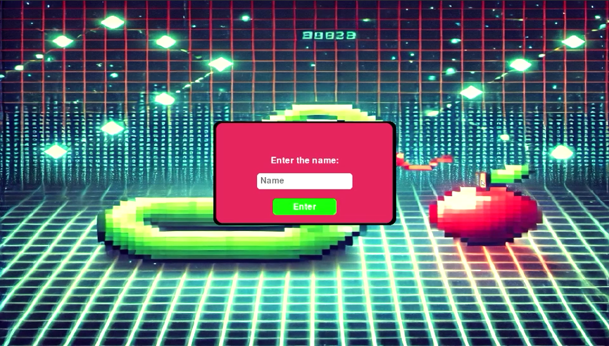
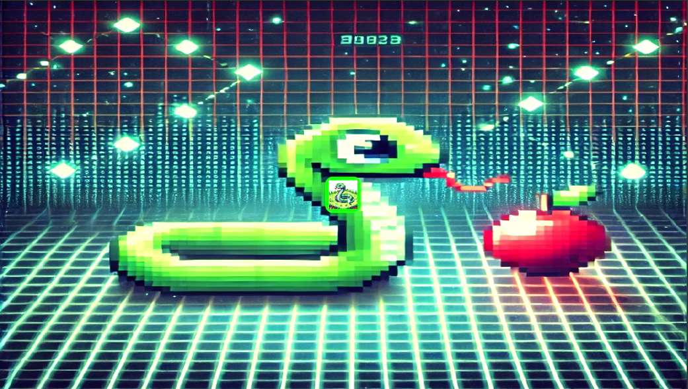
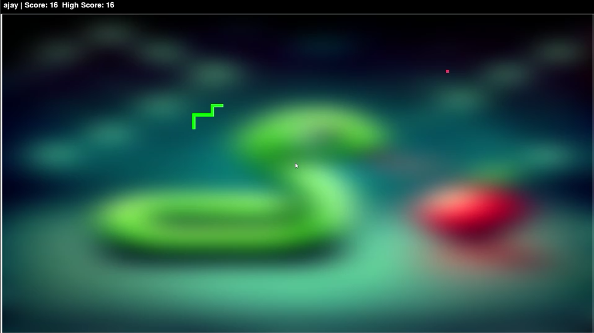
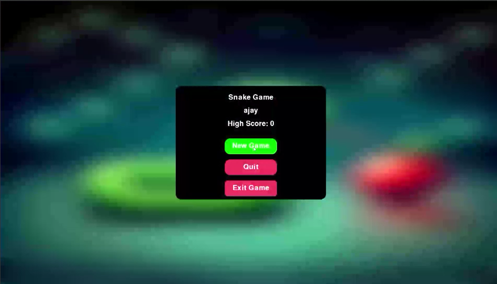
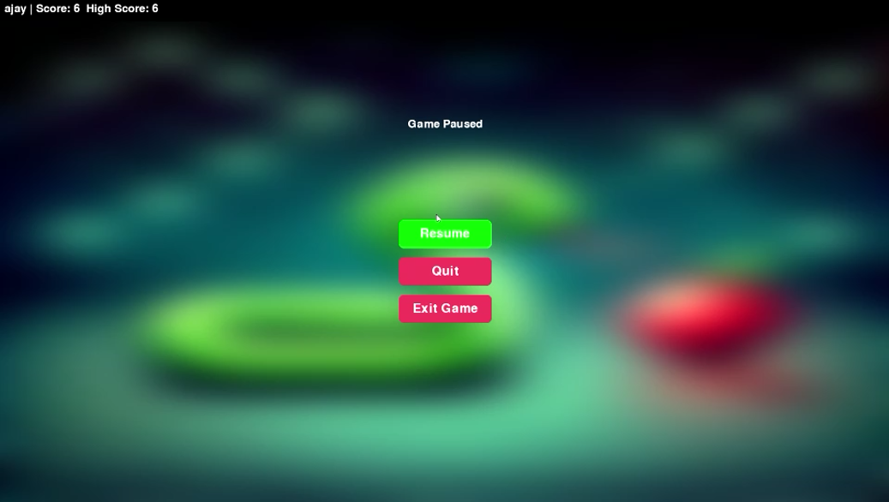
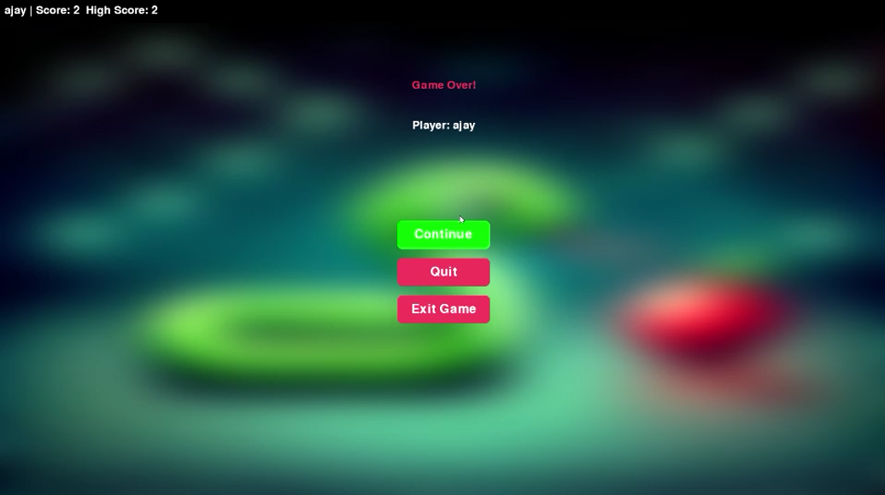

# 🐍 Snake Game with Social Features and Sound Effects

Welcome to the Snake Game, a modern take on the classic arcade game built with Python, Pygame, and Kivy! This version adds modern features like sound effects, background music, pause/resume functionality, high scores, player profiles, and even social features like chat and friend systems (Firebase-based).


## 🚀 Features

🎮 Classic Snake gameplay with full-screen support

🔊 Background music and sound effects (eat, death, button click, ticking clock)

🧠 Pause/Resume with smooth transitions

🥇 High score tracking per session

👤 Player name support


## _**🛠️ Installation**_

Clone the repository:
```
git clone https://github.com/your-username/snake-game.git
cd snake-game
```

### Install dependencies:
```
pip install -r requirements.txt
```

Run the game:

```
python main.py
```

## 🎮 Controls
Key	Action

W / ↑	Move Up

A / ←	Move Left

S / ↓	Move Down

D / →	Move Right

P	Pause/Resume


## _**To Do**_
 
 Game Loop with UI
 Sound integration
 Pause, Resume, Game Over
 Clock ticking sound

 ## **Screenshots**













 
License
MIT License. Feel free to modify, distribute, or contribute.

 
